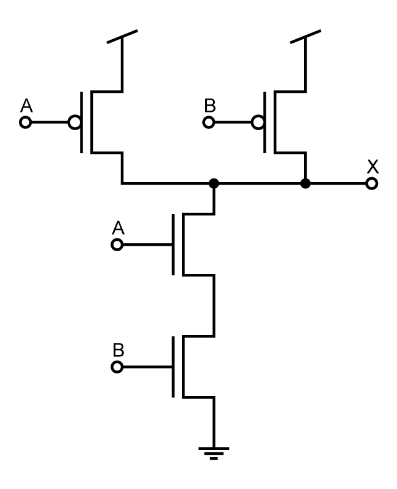

# Simple schematics building blocks
Illustrator files for creating simplistic circuit schematics as well as ready to use figures for common circuits.

## Credit
If you use this, remember to give credit to:
* **Name:** Ole Herman Schumacher Elgesem
* **URL:** https://github.com/olehermanse/schem

## License

 
This work is licensed under a <a rel="license" href="http://creativecommons.org/licenses/by/4.0/">Creative Commons Attribution 4.0 International License</a>.

## Table of contents
* [Sheets of symbols](https://github.com/olehermanse/schem/tree/master/sheets)
* [CMOS circuits (ready to use figures)](https://github.com/olehermanse/schem/tree/master/cmos)
* [CVSL circuits (ready to use figures)](https://github.com/olehermanse/schem/tree/master/cvsl)
* [Digital circuits (ready to use figures)](https://github.com/olehermanse/schem/tree/master/digital)

## Preview
Below are previews for some of the symbols and circuits. Click the images to go to the folder containing different versions of the file (.ai, .pdf, .png, .svg)
### sheets/electrical

### sheets/logic

### cmos/cmos_nand
 

### cvsl/cvsl_nand
 
